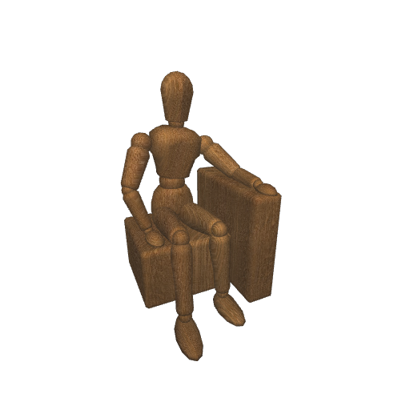

# Headless Rendering with glnext Python library

<div align="center">

[](#)

</div>

## Code

```py
import glnext
from PIL import Image
from objloader import Obj

instance = glnext.instance()

img = Image.open('resources/wood.jpg')
texture = instance.image(img.size)
texture.write(glnext.rgba(img.tobytes(), 'rgb'))

vertex_data = Obj.open('resources/dummy.obj').pack('vx vy vz nx ny nz tx ty tz')
vertex_count = len(vertex_data) // 36

framebuffer = instance.framebuffer((512, 512))
render = framebuffer.render(
    vertex_shader=open('resources/vertex.spv', 'rb').read(),
    fragment_shader=open('resources/fragment.spv', 'rb').read(),
    vertex_format='3f 3f 3f',
    vertex_count=vertex_count,
    buffers=[
        {
            'binding': 0,
            'name': 'uniform_buffer',
            'type': 'uniform_buffer',
            'size': 76,
        }
    ],
    images=[
        {
            'binding': 1,
            'type': 'sampled_image',
            'images': [texture],
        }
    ],
)

eye = (-51.0, -108.0, 110.0)
target = (0.0, 0.0, 65.0)
uniform_data = glnext.camera(eye, target) + glnext.pack([-140.0, -300.0, 350.0])

render['vertex_buffer'].write(vertex_data)
render['uniform_buffer'].write(uniform_data)

instance.run()

output = framebuffer.output[0].read()
result = Image.frombuffer('RGBA', (512, 512), output, 'raw', 'RGBA', 0, -1)
result.save('simple.png')
```
